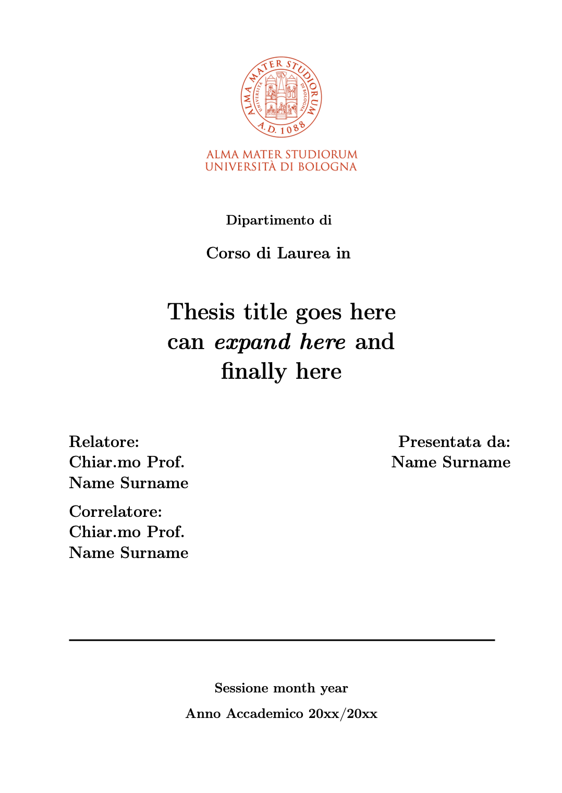

# Front page unibo

> Unofficial University of Bologna thesis' front page template for $\LaTeX$

[Available on Overleaf gallery](https://it.overleaf.com/latex/templates/frontespizio-unibo/bgsyvdmrzjzf)

You may find official guidelines for using the Unibo logo [here](https://www.unibo.it/it/ateneo/chi-siamo/immagine-identita-e-marchio).

Under the terms of this [document](https://www.unibo.it/it/ateneo/chi-siamo/immagine-identita-e-marchio/utilizzo-del-marchio-di-ateneo-nelle-tesi-elaborati), students are allowed to use Unibo's logo.

Additionally, University of Bologna offers its own [identity system](https://www.unibo.it/it/allegati/SistemaIdentitUniversitBologna.pdf/@@download/file/Sistema%20di%20identita%20di%20Ateneo.pdf).

